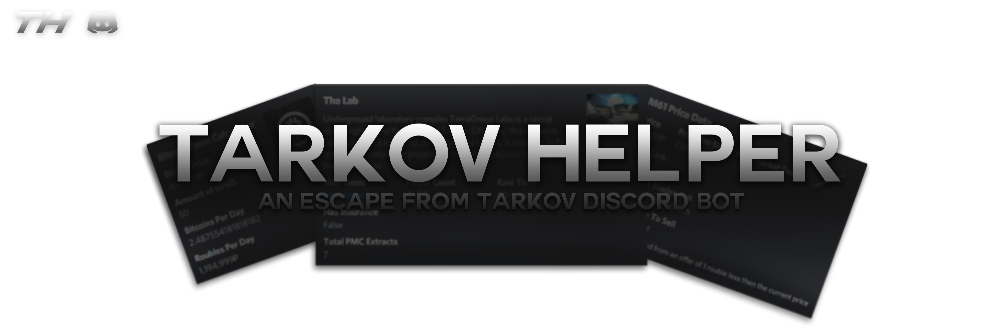

# Description (This Project Is Not Yet Finished)
**Tarkov Helper** is a Discord bot aimed to give users all kinds of information in an easy and read and use format.  

 - Tarkov Helper is using the new Discord Slash Command API so instead of using prefixs, just type `/` and a list of all valid commands will show. [Click Here](https://github.com/BetrixEdits/Tarkov-Helper/wiki/Commands) to see a more detailed explanation of all commands
 - Since most players use Discord as a way to communicate, having a discord bot to access information within the game will help with having to not open a browser and searching which will take more resources and time with the potential of lag in-game instead, now by typing in a command in a Discord server/channel, a simple alt-tab to an already open program will be much more efficient. Aswell as having extra useful features such as a **Bitcoin Farm Production Calculator** or a **Price Command**
 
 - Tarkov Helper is not associated with BattleState Games in any way 
 - Any use of Logos refering to Escape From Tarkov or in-game assets are owned by [BattleState Games](https://www.battlestategames.com)
 

# Adding Bot To Server
[**Click Here**](https://discord.com/api/oauth2/authorize?client_id=797600238449590334&permissions=0&scope=bot%20applications.commands) then **select a server** and hit **continue** to be able to add Tarkov Helper to your server.

# Building Yourself

**Requirements**
- [A code editor](https://code.visualstudio.com/download)
- [Git](https://git-scm.com/downloads) (Optional)
- [Node.js](https://nodejs.org/en/) 

**Setup**
- Download the repository to your project's folder. [**See Here**](https://docs.github.com/en/github/creating-cloning-and-archiving-repositories/cloning-a-repository)
- Run the `FirstRun.bat` file which will download dependencies as well as retrieve necessary game data. The bot should now be running
- To run the bot at other times, run the `StartBot.bat` file